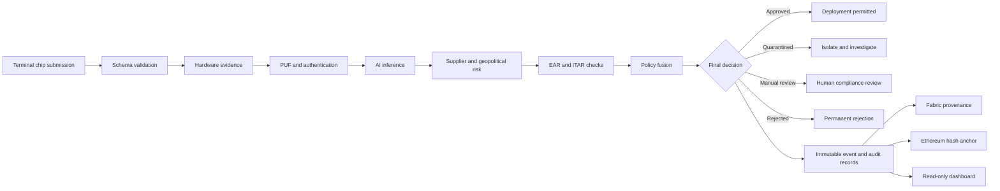

# SemiSecure Platform

**AI-Driven Semiconductor Supply Chain Security Platform**

SemiSecure is a terminal-controlled security platform for evaluating semiconductor devices and supply-chain evidence before deployment in critical infrastructure. It combines hardware-security analysis, machine-learning inference, compliance checks, supplier-risk assessment, immutable event storage, blockchain provenance, government-grade reporting, and a read-only operational dashboard.

## Core capabilities

- Hardware Trojan and anomaly detection using TensorFlow, PyTorch, and Scikit-learn.
- Physical Unclonable Function (PUF) authentication with replay protection.
- Hardware-tool integration for OpenTitan, ChipWhisperer, Yosys, Verilator, Digital Twin, and SBOM evidence.
- Supplier, geopolitical, sanctions, counterfeit, and provenance-risk analysis.
- Export-control evaluation using EAR and ITAR policy rules.
- Immutable JSON event store with hash-chain integrity and audit records.
- Hyperledger Fabric provenance and Ethereum hash anchoring.
- Read-only Flask dashboard with REST and Socket.IO updates.
- Terminal-originated scans, deterministic test scenarios, and government audit packages.

## Design principles

1. **Terminal-controlled operation:** scans originate from trusted command-line workflows.
2. **Read-only dashboard:** the browser displays evidence and decisions but does not initiate scans.
3. **No SQL database:** operational history is stored in append-only JSON events and indexes.
4. **Evidence before decision:** every verdict is traceable to hardware, AI, compliance, and provenance evidence.
5. **Defence in depth:** no single detector can approve a chip by itself.
6. **Fail secure:** severe Trojan, counterfeit, sanctions, or provenance failures cause quarantine or permanent rejection.
7. **Auditability:** decisions are reproducible, hashable, and suitable for regulator or examiner review.

## High-level workflow



## Project layout

```text
app/                 Flask application and platform services
  ai/                Feature extraction, models, inference, risk fusion
  api/               Versioned REST API
  blockchain/        Fabric and Ethereum integration
  compliance/        EAR, ITAR, supplier risk, policy, and reports
  dashboard/         Read-only templates, JavaScript, charts, timeline
  hardware/          PUF and external hardware-tool integrations
  integration/       Integrated pipeline service
  pipeline/          Production orchestration and decision routing
  storage/           JSON event store, audit store, indexes, recovery
  websocket/         Socket.IO namespace, subscriptions, publishing
blockchain/          Fabric network assets and Ethereum contracts
configs/             Application, AI, compliance, and integration settings
data/                Chip fixtures and generated runtime evidence
deployment/          WSGI and container entry point
docs/                Architecture decisions, runbooks, and documentation
models/              Trained model artefacts and manifests
schemas/             API, event, hardware, and compliance schemas
scripts/             Setup, deployment, maintenance, and verification tools
terminal/            Terminal command implementation
tests/               Unit, integration, API, dashboard, and regression tests
manage.py            Main terminal entry point
```

## Requirements

- Ubuntu 22.04 or later
- Python 3.12
- Docker and Docker Compose for container or blockchain workflows
- At least 8 GB RAM; 16 GB is recommended when TensorFlow, PyTorch, Fabric, and Ethereum run together
- Git
- `curl`, build tools, and standard Linux utilities

## Quick start

```bash
git clone https://github.com/AliRazaKhan-ai/semiconductor-security-platform.git
cd semiconductor-security-platform

python3.12 -m venv venv
source venv/bin/activate
python -m pip install --upgrade pip setuptools wheel
python -m pip install -r requirements.txt

./scripts/runtime/start_backend.sh
curl -fsS http://localhost:5000/health/ready | python -m json.tool
```

Open the dashboard:

```text
http://localhost:5000/dashboard
```

Run a terminal scan:

```bash
make semi-chip001      # good chip, all eight stages, about 130 seconds
make semi-chip002      # Trojan, stops at hardware security, about 35 seconds
make semi-fast         # all eight chips, three workers, about 5.5 minutes
```

Each target mints hardware evidence immediately before the scan. A PUF challenge
is single-use with a 120-second TTL and OpenTitan attestation expires after 300
seconds, so evidence minted earlier will have expired: anti-replay working, not a
fault.

## Expected reference scenarios

| Fixture | Decision | Stops at |
|---|---|---|
| chip_01_good | DEPLOY | completes all eight stages |
| chip_02_trojan | DENIED_AND_QUARANTINED | HARDWARE_SECURITY |
| chip_03_puf_unstable | HOLD_FOR_RETEST_OR_REJECT | PUF_AUTHENTICATION |
| chip_04_supplychain_tampered | DO_NOT_DEPLOY_PENDING_REVIEW | DEPLOYMENT_DECISION |
| chip_05_highrisk_supplier | DO_NOT_DEPLOY_PENDING_REVIEW | DEPLOYMENT_DECISION |
| chip_06_counterfeit | DENIED_AND_QUARANTINED | - |
| chip_07_sanctioned_manufacturer | REJECTED_PERMANENTLY | DEPLOYMENT_DECISION |
| chip_08_fake_provenance | DO_NOT_DEPLOY_PENDING_REVIEW | DEPLOYMENT_DECISION |

Measured across all eight fixtures in one run at three workers: 339.7s, 42.5s per
chip. Sequential and concurrent runs produce identical decisions.

chip_07 is rejected permanently because its supplier matches the Consolidated
Screening List at 100%, above the 96 deny threshold. Above that threshold there is
no discretionary band, so the decision is terminal rather than a quarantine, which
would imply a part that could be released after investigation. Its end user matches
the same list at only 49.3%, so before both parties were screened the chip failed
for an unrelated reason: its USML category.

A counterfeit chip is quarantined rather than rejected. The evidence shows the part
is not what it claims, which is a different finding from a party the transaction may
not lawfully involve.

The Trojan is caught by ChipWhisperer side-channel analysis, at an anomaly score
of 0.4508 against a 0.35 threshold, before Yosys runs. The underlying signal is
structural: the candidate netlist has 27 cells against the 8-cell reference.

## Health and verification

```bash
curl -fsS http://localhost:5000/health/live
curl -fsS http://localhost:5000/health/ready | python -m json.tool
python -m pytest -q
```

A production instance is considered ready only when `/health/ready` reports `"status": "ready"` and all required storage checks are healthy.

## Documentation

- [Architecture Guide](docs/ARCHITECTURE_GUIDE.md)
- [Installation Guide](docs/INSTALLATION_GUIDE.md)
- [Developer Guide](docs/DEVELOPER_GUIDE.md)
- [API Documentation](docs/API_DOCUMENTATION.md)
- [Troubleshooting Guide](docs/TROUBLESHOOTING_GUIDE.md)

## Security warning

Never commit `.env.production`, passwords, API tokens, Fabric private keys, Ethereum private keys, wallet identities, mnemonics, generated audit evidence, or runtime event-store content.

## Licence

Proprietary educational project by Ali Raza. Third-party components retain their respective licences.
