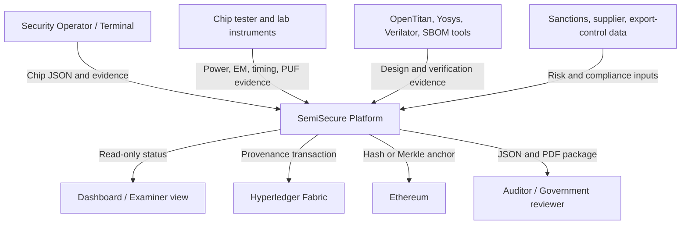
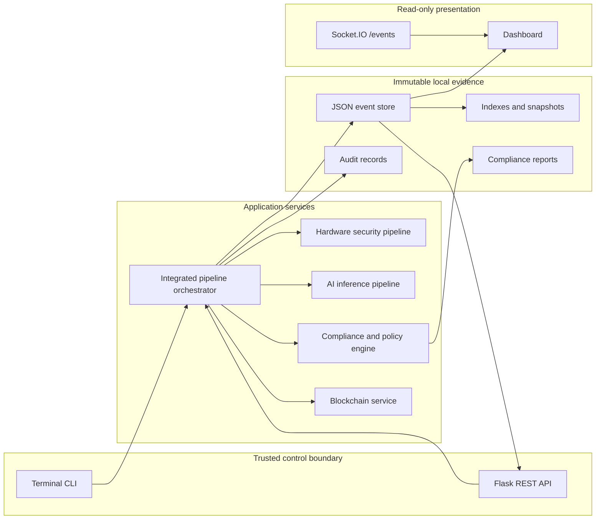
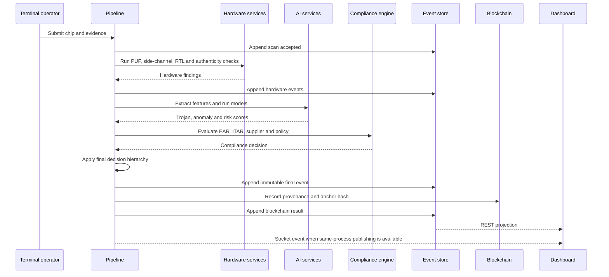

# Architecture Guide

## 1. Architectural objective

SemiSecure evaluates whether a semiconductor device is trustworthy enough for deployment in critical infrastructure. The architecture is designed around four questions:

1. Is the chip technically authentic?
2. Is there evidence of a hardware Trojan or abnormal behaviour?
3. Is the supplier and transaction legally acceptable?
4. Can the complete decision be independently verified later?

The platform answers these questions through layered evidence rather than a single classifier.

## 2. Architectural style

SemiSecure uses a **modular monolith with external trust services**:

- Flask hosts the REST API, health endpoints, dashboard, and service composition.
- Domain services remain separated by package boundaries.
- JSON event storage replaces a relational database.
- Hyperledger Fabric and Ethereum operate as external trust layers.
- Hardware and EDA tools are integrated through adapters.
- Terminal commands initiate scans; the dashboard remains read-only.

This approach is appropriate for an educational and production-style reference platform because it keeps deployment manageable while preserving clear security boundaries.

## 3. Context diagram

## 4. Component architecture

## 5. Major components

### 5.1 Application factory

`app/factory.py` is the composition root. It:

- loads configuration;
- configures logging;
- creates the Flask application;
- initialises the event and audit stores;
- initialises Socket.IO;
- builds blockchain, AI, hardware, and compliance services;
- registers security headers, rate limiting, error handling, REST routes, health routes, and dashboard routes;
- constructs the integrated pipeline service.

A component that cannot initialise is logged and stored as unavailable rather than crashing unrelated read-only functions. Final pipeline policy must still fail securely when a required security component is unavailable.

### 5.2 Event store

The event store is append-only and JSON-based. Its responsibilities include:

- immutable event records;
- per-scan sequencing;
- hash-chain integrity;
- filesystem locking;
- partitions and indexes;
- snapshots for fast reads;
- verification and recovery.

This design supports auditability and avoids hidden mutation. A scan's state is reconstructed from its history rather than overwritten in place.

### 5.3 Hardware security pipeline

The hardware layer can collect or simulate:

- ring-oscillator and delay-chain PUF responses;
- voltage and temperature drift;
- noise tolerance;
- anti-cloning evidence;
- replay detection;
- ChipWhisperer side-channel evidence;
- OpenTitan trust and root-of-trust evidence;
- Yosys synthesis and RTL analysis;
- Verilator simulation results;
- digital-twin consistency;
- SBOM and component evidence.

### 5.4 AI pipeline

The AI subsystem combines three types of analysis:

- **TensorFlow classifier:** supervised Trojan classification.
- **PyTorch autoencoder:** anomaly detection for previously unseen behaviour.
- **Scikit-learn risk engine:** calibrated risk scoring and policy-support features.

Feature extraction combines design, physical, and supply-chain evidence. Model manifests and integrity checks help prevent accidental or malicious model substitution. A fallback rules engine supports deterministic fail-secure behaviour when models are unavailable.

### 5.5 Compliance and policy

The compliance subsystem evaluates:

- EAR classification and licence requirements;
- ITAR applicability;
- restricted or sanctioned parties;
- supplier and geopolitical risk;
- transaction and destination context;
- counterfeit and provenance evidence.

The policy engine fuses these results with AI and hardware evidence. Severe controls override average scores. For example, a sanctioned manufacturer or fake provenance cannot be approved merely because the AI model reports low Trojan probability.

### 5.6 Blockchain trust layer

Hyperledger Fabric stores permissioned provenance suitable for known supply-chain organisations. Ethereum anchors hashes or Merkle roots to provide independent tamper evidence.

The blockchain does not replace the event store. The local event store contains detailed evidence, while blockchain records prove that a specific decision or report existed in a particular form.

### 5.7 Dashboard and WebSocket

The dashboard is deliberately read-only. It presents:

- scan summaries;
- final status;
- stage timeline;
- risk and confidence;
- hardware evidence;
- compliance outcomes;
- supplier information;
- blockchain provenance;
- system health;
- notifications.

Socket.IO uses the `/events` namespace for live backend events. REST polling remains a durable fallback because terminal scans may execute in a separate process from the long-running Flask server.

## 6. End-to-end sequence

## 7. Decision hierarchy

A recommended interpretation of the platform's routing is:

1. **Permanent rejection**
   - counterfeit identity;
   - sanctioned or prohibited manufacturer;
   - fabricated or cryptographically invalid provenance;
   - explicit non-overridable policy violation.

2. **Quarantine**
   - hardware Trojan indication;
   - weak or replayed PUF;
   - supply-chain tampering;
   - severe unexplained anomaly.

3. **Manual review**
   - elevated supplier or geopolitical risk;
   - incomplete evidence;
   - licence ambiguity;
   - conflicting but non-critical signals.

4. **Approval**
   - hardware, AI, supplier, compliance, and provenance checks all meet policy thresholds.

## 8. Trust boundaries

| Boundary | Risk | Control |
|---|---|---|
| Terminal to API/pipeline | malformed or falsified evidence | JSON schema validation, trusted operator workflow, audit records |
| External tools to adapters | tool compromise or altered output | adapter validation, signatures/hashes where available, fail-secure errors |
| AI models | model tampering or drift | manifests, integrity checks, model registry, fallback rules |
| Event store filesystem | deletion or mutation | append-only records, locks, hash chain, verification and backups |
| Browser dashboard | unauthorised operational action | read-only UI, no scan initiation |
| Fabric/Ethereum | transaction failure or unavailable network | local evidence remains authoritative; status recorded; retry/reconciliation |
| Compliance data | stale or incomplete lists | versioned rules, review dates, manual-review routing |

## 9. Failure and recovery

- Storage readiness is exposed through `/health/ready`.
- Event-store integrity can be verified through the Flask CLI.
- Failed blockchain anchoring must not erase the local decision.
- Missing AI models should trigger deterministic fallback or manual review, never silent approval.
- Corrupt indexes can be rebuilt from immutable events.
- Dashboard notification loss is mitigated by REST-based state synchronisation.
- Runtime data should be backed up separately from source code.

## 10. Scalability considerations

The current architecture is suitable for a single-node or controlled laboratory deployment. Scaling should introduce:

- Redis or another Socket.IO message queue for multiple web workers;
- shared or replicated object storage for evidence;
- a task queue for long-running hardware and AI jobs;
- independent model-serving processes;
- Fabric node redundancy;
- Ethereum provider redundancy;
- centralised logging and metrics;
- signed supply-chain evidence from external organisations.

Until a shared Socket.IO message queue is configured, run one Gunicorn worker to avoid inconsistent live-event delivery.

## 11. Security trade-offs

- **No authentication:** intentionally aligned with the current project constraint, but production internet exposure would require identity, authorisation, and network controls.
- **JSON storage:** maximises transparency and portability but needs disciplined locking, retention, and backup.
- **Blockchain anchoring:** improves tamper evidence but adds operational dependencies and transaction latency.
- **AI plus rules:** AI increases detection capability, while deterministic rules prevent unsafe model-only decisions.
- **Read-only dashboard:** reduces attack surface but retains terminal operational dependency.

## 12. Architecture defence statement

The key architectural decision is to separate **evidence collection**, **risk inference**, **legal/compliance evaluation**, and **trust recording**. This prevents one subsystem from acting as a single point of approval and gives examiners, auditors, and operators a traceable explanation for every result.
