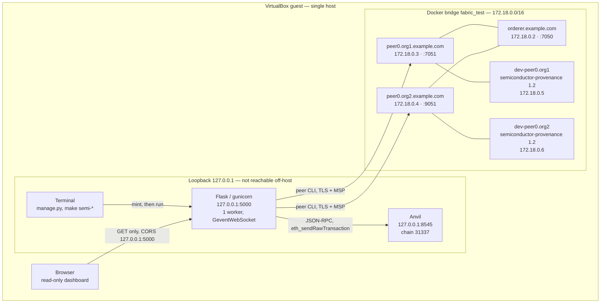

# Network Architecture

Single host. Every address below was read from `ss -ltnp` and
`docker network inspect fabric_test` on the running system.

## Topology

## Listening sockets, as measured

| Service | Bind | Reachable off-host |
|---|---|---|
| Flask / gunicorn | `127.0.0.1:5000` | No |
| Anvil | `127.0.0.1:8545` | No |
| Fabric orderer | `0.0.0.0:7050` | **Yes** |
| Fabric peer0.org1 | `0.0.0.0:7051` | **Yes** |
| Fabric peer0.org2 | `0.0.0.0:9051` | **Yes** |
| Fabric operations | `0.0.0.0:9443-9445` | **Yes** |

The application binds loopback in every environment: `configs/application/app.json`
and all three files under `configs/environments/`.

The Fabric containers publish to every interface. This is the `fabric-samples`
test-network default rather than a configured choice. Access is still gated by TLS
with MSP identity, but it is wider than the boundary `SECURITY.md` describes, and a
deployment outside a trusted network would bind these to loopback or place them on an
internal segment.

## Trust boundaries

Five, matching `docs/security/THREAT_MODEL.md`. Only one is a network edge.

1. **Terminal to platform.** The trust anchor. A user with shell access already holds
   `.env`, the data directory and the MSP material, so the operating-system account is
   the real perimeter. This is why there is no application login.
2. **Platform to external tool processes.** Yosys, Verilator and `peer` run as
   subprocesses through `CommandRunner`: argument lists rather than a shell, bounded
   timeouts, path validation.
3. **Platform to Fabric.** TLS to peer and orderer, MSP identity, endorsement across
   both organisations.
4. **Platform to Ethereum.** Loopback JSON-RPC. The signing key comes from the
   environment, never from configuration.
5. **Platform to browser.** One direction. GET-only client, server-side test, CORS
   restricted to `http://127.0.0.1:5000` and `http://localhost:5000`.

## What is not here

No load balancer, no reverse proxy, no TLS termination in front of the application,
no network segmentation between the application and the ledger, no firewall rules
beyond the host default, no ingress. The platform runs on one host and
`SECURITY.md` requires a controlled network around it.
